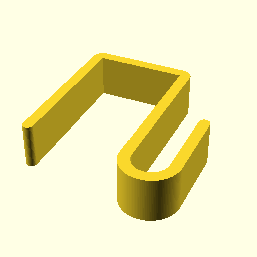
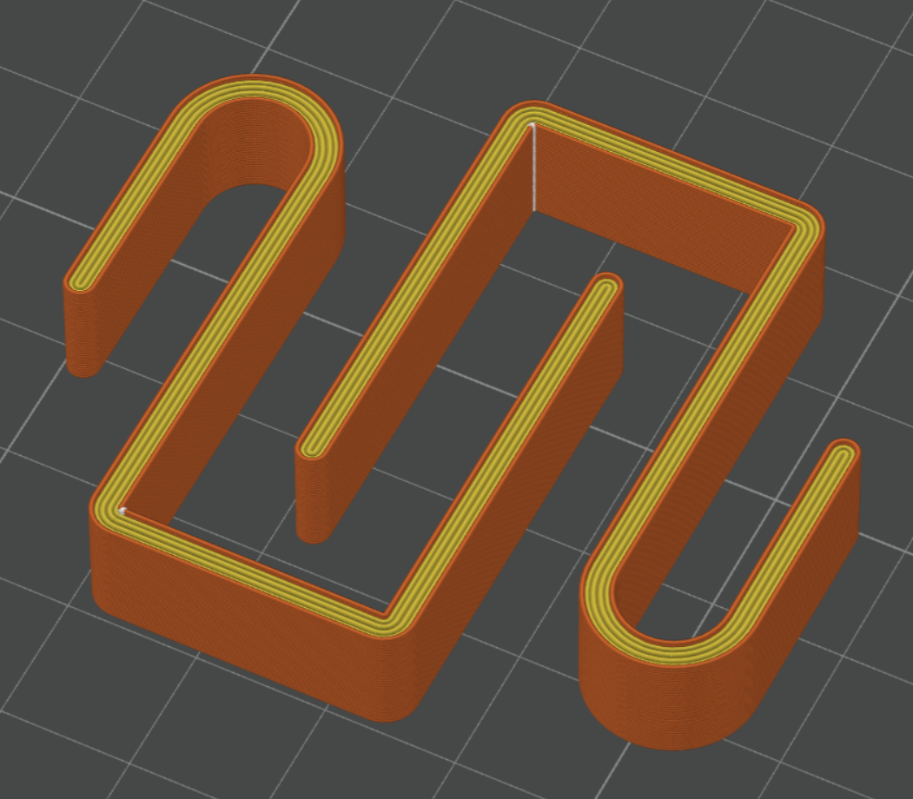

# Parametric Edge Hook

Reworked this "bathroom hoook" model: <https://www.myminifactory.com/object/3d-print-parametric-bathroom-hook-117600>

- for my application, I needed a shorter hook, but deeper to hold a hanging
  organizer flush with the edge of shelf, with minimal slop for vibration
  purposes
- cleaned up scad code a little
- rounded the back endcap
- centered model geometry fwiw

# Suggested Slicer Settings

I used a 0.4mm nozzle, and sliced them to be "all walls":
- 3 walls
- 0% (no) infill
- 0 top/bottom layers

Here's what a pair of them looked like in my slicer:

[BY-NC-SA](https://creativecommons.org/licenses/by-nc-sa/4.0/)
